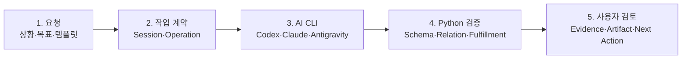

<div align="center">

# Schema Workflow Operations Dashboard

Codex, Claude Code, Antigravity의 실행을 근거와 산출물로 검증하는 Windows 로컬 운영 도구

<p>
  
  
  
  
  
</p>

</div>

<p align="center">
  
</p>

## 프로젝트 한눈에 보기

- **문제:** 여러 AI CLI의 요청·실행·근거·산출물이 서로 다른 폴더에 흩어져 완료 여부와 작업 관계를 복원하기 어려웠습니다.
- **구현:** Nuxt Dashboard와 Python Workflow Engine을 분리하고, 원본 실행 기록을 읽기 전용으로 투영했습니다.
- **검증:** Dashboard `92/92`, typecheck·production build, 운영판·공개판 `90/90` 파일 SHA-256 일치를 확인했습니다.

`Nuxt 4` · `TypeScript` · `Vitest` · `Python` · `JSON/JSONL` · `Windows local-first`

[문제 정의](#해결하려는-문제) · [구현 구조](#구현한-시스템) · [문제 해결](#대표-문제-해결) · [검증 결과](#검증-결과) · [빠른 실행](#빠른-화면-확인)

## 해결하려는 문제

AI 에이전트가 파일을 만들고 “완료”라고 보고해도 운영 관점에서는 다음 질문이 남습니다.

- 어떤 프로젝트와 사용자 작업에서 시작한 실행인가?
- 새 작업인가, 기존 Run의 이어가기 또는 분기인가?
- 원문 요청이 요약되거나 잘리지 않았는가?
- 통과 상태를 뒷받침하는 근거와 산출물이 실제로 존재하는가?
- 자동 검증을 통과한 결과를 사용자가 직접 검토했는가?

특히 여러 터미널과 AI CLI가 같은 프로젝트를 다루면 duplicate Run, 잘못된 parent, 오래된 관계, Operation 상태 불일치와 산출물 누락이 발생할 수 있습니다. 이 프로젝트는 채팅의 완료 문구 대신 아래 관계와 파일 근거를 사용해 현재 상태를 복원합니다.

```text
Project -> WorkSession -> Operation -> Run -> Evidence / Artifact -> User Review
```

## 구현한 시스템



대시보드는 AI CLI를 내부에 다시 구현하지 않습니다. 실행 전에는 원문과 관계 계약을 준비하고, 실행 후에는 Engine이 남긴 Manifest, Evidence, Artifact와 fulfillment 결과를 읽어 사용자가 현재 상태와 다음 행동을 판단할 수 있게 합니다.

[상세 기술 흐름 인포그래픽 보기](deliverables/docs/images/workflow-technical-flow.svg)

### 책임 경계

| 구성요소 | 담당하는 일 | 하지 않는 일 |
|---|---|---|
| AI CLI | 자연어 해석, 후보 생성, 산출물 작성 | 검증되지 않은 값을 자동 확정하지 않음 |
| Python Workflow Engine | 입력 구조화, 스키마·상태·완료 조건 검증 | 사용자 대신 최종 판단하지 않음 |
| Relationship Gateway | WorkSession·Run 관계 생성, 충돌·순환·중복 방지 | Run Manifest를 직접 수정하지 않음 |
| Nuxt Dashboard | 원본 상태 조회, 실행 준비, 상세 검토, 사용자 메타데이터 관리 | 화면 편집으로 Engine 판정을 덮어쓰지 않음 |
| Release Manager | 설치본 무결성, 활성 버전과 rollback 경계 관리 | 프로젝트의 실행 데이터에 관여하지 않음 |

원본 실행 기록과 화면 운영 정보도 분리했습니다. 표시 이름, 사용자 메모, 검토 상태와 정렬 순서는 별도 Registry에 저장되므로 화면에서 이름을 바꿔도 Engine의 pass/fail과 원본 식별자는 달라지지 않습니다.

## 대표 문제 해결

실제 운영 데이터 감사에서 확인한 결함을 예외로 버리지 않고 Gateway, Read Adapter와 UI 상태의 회귀 테스트로 전환했습니다.

| 관측된 문제 | 적용한 해결 |
|---|---|
| 교체 전 Run 관계가 남음 | authoritative Operation→Run 매핑을 기준으로 재연결하고 이전 관계를 supersede |
| Windows Evidence가 손상으로 표시됨 | UTF-8 BOM만 제거한 뒤 원래 JSON 객체 계약을 검증 |
| 파일 생성이 전체 요청 완료로 표시됨 | acceptance criteria, fulfillment, 사용자 검토 상태를 분리 |
| 템플릿과 수동 세션의 결과가 다름 | 모든 입력 방식을 같은 WorkSession·Operation 계약으로 통합 |
| 자동 통과가 사용자 승인처럼 보임 | Engine 판정과 `reviewed_at`을 독립 저장·집계 |

세부 원인, 코드 경계와 검증 과정은 [포트폴리오 사례 문서](deliverables/portfolio_case_study.md)에 기록했습니다.

## 주요 기능

| 기능 | 설명 |
|---|---|
| 다중 프로젝트 카탈로그 | 여러 ProjectRoot를 등록하고 작업 공간을 전환합니다. |
| WorkSession·Run 관리 | 새 작업, 이어가기와 분기를 구분하고 OperationId로 실행을 연결합니다. |
| 실행 템플릿 | 프로젝트 시작, 기능 추가, 유지보수, 완료 검토용 실행 기준을 생성합니다. |
| 근거 기반 상태 검토 | 통과, 근거 부족, 보류와 사용자 미검토 상태를 구분합니다. |
| 파이프라인 상세 검토 | 원문, Operation, Run, Evidence, Artifact와 fulfillment를 한 흐름으로 대조합니다. |
| 표시 정보 편집 | 긴 Run ID 대신 사용자 제목과 메모를 사용하면서 원본 식별자를 함께 보존합니다. |
| CLI 작업 준비 | 플랫폼별 실행 명령, 프로젝트 스킬 상태와 VS Code 작업 공간을 준비합니다. |
| 반응형 검토 화면 | 데스크톱 집중 화면, 전체 보드와 모바일 검토 화면을 제공합니다. |

## 검증 결과

### 현재 공개 릴리스

| 검증 항목 | 결과 | 의미 |
|---|---:|---|
| Dashboard Vitest | `92/92 PASS` | 현재 공개 소스의 UI·API·관계·검토 회귀 |
| Nuxt typecheck | PASS | TypeScript 계약 확인 |
| Nuxt production build | PASS | 운영 빌드 생성 확인 |
| 운영판·공개판 비교 | `90/90` | 추적 파일 SHA-256 일치 |
| 문서 내부 링크 | 누락 0 | README와 문서 인덱스 기준 |
| 공개 안전성 검사 | 신규 노출 0 | 사용자 절대경로·비밀값·Runtime 데이터 제외 |

### 개발 과정의 기준선

| 기준선 | 결과 | 사용 목적 |
|---|---:|---|
| Python Workflow·Router·Fulfillment·Governance | `110/110` | Engine 경계 검증 |
| 초기 Dashboard 후보판 | `61/61` | 운영 감사와 UI 회귀 시작점 |
| 당시 통합 자동 회귀 | `171/171` | 초기 suite 통합 기준선 |
| 읽기 전용 운영 스냅샷 | 9 Projects / 68 Runs | 실제 데이터 구조와 결함 유형 감사 |

개발 기준선은 현재 환경의 일반 성능을 보장하는 수치가 아닙니다. 측정 조건과 현재 릴리스의 구분은 [검증 보고서](deliverables/validation_report.md)와 [1.0.6 동기화 보고서](deliverables/release_1.0.6_sync_report.md)에 보존합니다.

## 빠른 화면 확인

Node.js 20 이상과 Corepack이 필요합니다. 아래 실행은 익명 Mock 데이터만 사용하며 실제 사용자 파일을 읽거나 수정하지 않습니다.

```powershell
git clone https://github.com/LEESEOBAEK/Schema-Workflow-Operations-Dashboard.git
Set-Location '.\Schema-Workflow-Operations-Dashboard\apps\dashboard-vnext'
corepack pnpm install --frozen-lockfile
$env:NUXT_DASHBOARD_DATA_MODE = 'mock'
corepack pnpm dev --port 3215
```

브라우저에서 `http://localhost:3215/hybrid`를 엽니다.

### 처음 볼 때 확인할 세 가지

1. **상태:** 통과, 근거 부족, 보류 중 어디에 있는지 확인합니다.
2. **근거와 산출물:** 판단을 뒷받침하는 파일과 실제 결과물이 존재하는지 확인합니다.
3. **다음 행동:** 사용자 검토, 추가 입력 또는 후속 작업이 필요한지 확인합니다.

설치부터 실제 프로젝트 연결까지의 단계별 설명은 [AI 운영 입문 가이드](deliverables/getting_started_for_ai_operations.md)를 참고하세요.

## 실제 사용 흐름

| 단계 | 사용자 행동 | 시스템 기록 |
|---|---|---|
| 1. 프로젝트 선택 | 기존 ProjectRoot 선택 또는 새 프로젝트 등록 | 프로젝트 계약과 식별자 |
| 2. 작업 정의 | 템플릿에 현재 상황과 제약 입력 | 원본 템플릿과 프로젝트 실행본 |
| 3. CLI 준비 | Codex, Claude Code, Antigravity 중 환경 선택 | OperationId, 관계 계약, UTF-8 원문 |
| 4. Workflow 실행 | 외부 CLI에서 분석·생성·검증 수행 | Run Manifest, Evidence, Artifact |
| 5. 자동 연결 | OperationId로 Run을 WorkSession에 연결 | 독립·이어가기·분기 관계 |
| 6. 상세 검토 | 요청, 근거, 산출물과 완료 조건 대조 | 검증 상태와 다음 행동 |
| 7. 사용자 확인 | 결과를 확인하고 검토 완료 처리 | 원본과 분리된 사용자 검토 상태 |

## 화면

<table>
  <tr>
    <td width="32%" align="center">
      
    </td>
    <td width="68%">
      <strong>화면 크기가 달라도 같은 검토 순서를 유지합니다.</strong>
      <br><br>
      프로젝트와 WorkSession을 선택한 뒤 Run 상태, 다음 행동, 근거와 산출물을 확인합니다. 모바일에서는 현재 선택 항목과 핵심 판단 정보를 세로 흐름으로 제공합니다.
    </td>
  </tr>
</table>

## 저장소 구조

```text
Schema-Workflow-Operations-Dashboard/
├─ apps/dashboard-vnext/   Nuxt Dashboard와 Vitest
├─ packaging/              Windows Bundle 빌드·설치·실행 스크립트
├─ fixtures/               공개 가능한 익명 Mock 데이터
├─ deliverables/           아키텍처, 검증, 사례 문서와 화면 이미지
├─ LICENSE
└─ THIRD_PARTY_NOTICES.md
```

## Windows 통합 번들

실제 로컬 운영은 GitHub Release의 `SchemaWorkflow-Windows-<version>.zip`을 사용합니다. 통합 번들은 파일 무결성, 활성 릴리스와 `doctor` 상태를 확인하며, 프로젝트별 스킬 설치와 자동 실행 허용은 별도 승인을 요구합니다.

```powershell
powershell.exe -NoProfile -ExecutionPolicy Bypass -File `
  .\Install-SchemaWorkflowBundle.ps1 `
  -Channel stable `
  -Approved

powershell.exe -NoProfile -ExecutionPolicy Bypass -File `
  .\Start-SchemaWorkflowDashboard.ps1 `
  -Port 3215
```

## 현재 범위와 제한

**현재 지원**

- Windows 개인 로컬 운영
- Codex, Claude Code, Antigravity 결과 읽기
- Project, WorkSession, Operation, Run 관계와 근거 표시
- 실행 템플릿, 파이프라인 상세 검토와 사용자 검토 상태
- 익명 Mock 모드와 Windows 통합 패키징

**아직 보장하지 않음**

- 다중 사용자 권한과 원격 협업
- Windows 이외 운영 환경
- 500개 이상 Run에 대한 대규모 성능
- 모든 AI CLI 버전에 대한 자동 호환
- AI의 숨은 추론 과정 수집

## 문서 지도

| 문서 | 읽는 목적 |
|---|---|
| [포트폴리오 사례](deliverables/portfolio_case_study.md) | 실제 결함, 원인 분석, 개선과 검증 과정 |
| [아키텍처](deliverables/architecture.md) | 구성요소, 데이터 흐름과 책임 경계 |
| [기술 의사결정](deliverables/technical_decisions.md) | 선택한 구조, 이유와 트레이드오프 |
| [기능 상태표](deliverables/feature_status_matrix.md) | 기능별 완료 상태, 제한과 후속 범위 |
| [AI 운영 입문 가이드](deliverables/getting_started_for_ai_operations.md) | 처음 사용하는 사람을 위한 개념과 실행 순서 |
| [성능 기준](deliverables/performance_baseline.md) | 측정 환경, 지표와 해석 범위 |
| [공개 패키지 검증](deliverables/public_package_validation.md) | 공개 안전성과 패키지 구성 확인 |
| [1.0.6 동기화 보고서](deliverables/release_1.0.6_sync_report.md) | 운영판과 공개 소스의 일치 범위 |

## 설계 원칙

- AI의 완료 주장을 파일·해시·관계·완료 조건보다 우선하지 않습니다.
- 원본 Manifest와 Evidence는 읽기 전용으로 유지합니다.
- 자동 검증 통과와 사용자 검토 완료를 구분합니다.
- 확인되지 않은 값과 관계를 화면 편의를 위해 임의 확정하지 않습니다.
- 공개 저장소에는 익명 Mock 데이터만 포함합니다.

## License

소스 코드는 [MIT License](LICENSE)로 공개합니다. 실제 운영 Database, 사용자 절대경로, `.env`, `.data`, 실행 로그와 설치된 Engine 릴리스는 Git에서 제외하며, 포함된 제3자 자산은 각 원래 라이선스를 따릅니다.
