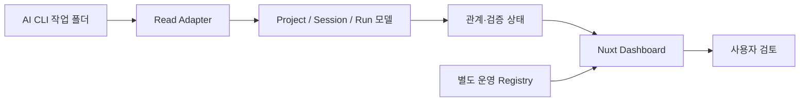

<div align="center">

# Schema Workflow Operations Dashboard

**여러 AI CLI의 작업 기록을 프로젝트, 작업 세션, 실행, 근거, 산출물 관계로 연결해 검토하는 로컬 운영 대시보드**


</div>

<p align="center">
  
</p>

## 프로젝트 소개

Codex, Claude Code, Antigravity 같은 AI CLI를 여러 프로젝트에서 사용하면 요청, 실행 기록, 근거와 산출물이 서로 다른 폴더에 흩어집니다. 완료됐다는 응답만으로는 어떤 요청에서 시작됐고 무엇을 근거로 통과했는지 다시 확인하기 어렵습니다.

Schema Workflow Operations Dashboard는 로컬 파일을 원본으로 유지하면서 다음 관계를 한 화면에서 읽고 검토합니다.

```text
Project -> Work Session -> Run -> Evidence / Artifact -> User Review
```

대시보드는 원본 실행 기록을 임의로 수정하지 않습니다. 사용자가 붙인 표시 이름, 검토 상태, 정렬 순서처럼 화면 운영에 필요한 정보는 별도 Registry에 기록합니다.

## 주요 기능

| 기능 | 설명 |
|---|---|
| 프로젝트 카탈로그 | 여러 ProjectRoot를 등록하고 작업 공간을 전환합니다. |
| 작업 세션 관리 | 새 작업, 이어가기, 분기를 구분하고 동일 Run의 관계를 추적합니다. |
| 실행 템플릿 | 프로젝트 시작, 기능 추가, 유지보수, 완료 검토용 실행 명세를 생성합니다. |
| 상태 검토 | 통과, 근거 부족, 보류와 사용자 미검토 상태를 구분합니다. |
| 파이프라인 상세 검토 | 실행 기준, Run, 근거, 산출물, 완료 검증을 한 흐름으로 대조합니다. |
| 근거·산출물 탐색 | 연결된 파일명과 요약을 확인하고 실제 산출물 경로를 추적합니다. |
| 표시 정보 편집 | 긴 Run ID 대신 사용자 제목과 메모를 사용하되 원본 식별자는 함께 보존합니다. |
| CLI 작업 준비 | 플랫폼별 실행 명령과 프로젝트 스킬 상태를 확인하고 VS Code 작업 공간을 준비합니다. |
| 반응형 화면 | 데스크톱 집중 화면, 전체 보드와 모바일 검토 화면을 제공합니다. |

## 화면

<table>
  <tr>
    <td width="32%" align="center">
      
    </td>
    <td width="68%">
      <strong>화면 크기가 달라도 같은 판단 흐름을 유지합니다.</strong>
      <br><br>
      프로젝트와 작업 세션을 선택한 뒤 Run 상태, 다음 행동, 근거와 산출물을 확인합니다. 모바일에서는 핵심 단계와 현재 선택 항목을 세로 흐름으로 제공합니다.
    </td>
  </tr>
</table>

## 구조



```text
Schema-Workflow-Operations-Dashboard/
├─ apps/dashboard-vnext/   Nuxt 대시보드와 테스트
├─ packaging/              Windows 번들 빌드·설치·실행 스크립트
├─ fixtures/               공개 가능한 익명 Mock 데이터
├─ deliverables/           설계, 검증, 포트폴리오 문서와 화면 이미지
├─ LICENSE
└─ THIRD_PARTY_NOTICES.md
```

## 빠른 화면 확인

Node.js 20 이상과 Corepack이 필요합니다.

```powershell
git clone https://github.com/LEESEOBAEK/Schema-Workflow-Operations-Dashboard.git
Set-Location '.\Schema-Workflow-Operations-Dashboard\apps\dashboard-vnext'
corepack pnpm install --frozen-lockfile
$env:NUXT_DASHBOARD_DATA_MODE = 'mock'
corepack pnpm dev --port 3215
```

브라우저에서 `http://localhost:3215/hybrid`를 엽니다. Mock 모드는 실제 사용자 경로나 운영 데이터 없이 화면과 공개 기능을 확인하기 위한 방식입니다.

## Windows 통합 번들

실제 로컬 운영은 GitHub Release에 첨부되는 `SchemaWorkflow-Windows-<version>.zip` 형식을 사용합니다. 압축 해제 후 승인 플래그와 함께 설치하고 실행합니다.

```powershell
powershell.exe -NoProfile -ExecutionPolicy Bypass -File `
  .\Install-SchemaWorkflowBundle.ps1 `
  -Channel stable `
  -Approved

powershell.exe -NoProfile -ExecutionPolicy Bypass -File `
  .\Start-SchemaWorkflowDashboard.ps1 `
  -Port 3215
```

통합 번들은 파일 무결성, 불변 엔진 릴리스, 활성 버전과 `doctor` 상태를 확인합니다. 프로젝트별 스킬 설치와 자동 실행 허용은 대시보드에서 별도 승인을 받아 처리합니다.

## 검증 상태

현재 공개 소스 기준 검증 결과입니다.

- Dashboard 테스트: `92/92` 통과
- TypeScript 및 Nuxt 타입 검사: 통과
- Nuxt 운영 빌드: 통과
- Windows 안정판 번들: `1.0.6`
- 공개 안전성: 실제 운영 Database, `.env`, `.data`, 실행 로그 제외

성능 수치는 PC 환경과 데이터 규모에 따라 달라집니다. 자세한 측정 조건은 [성능 기준 문서](deliverables/performance_baseline.md)를 참고하세요.

## 범위와 제한

### 현재 포함

- Windows 개인 로컬 운영
- Codex, Claude Code, Antigravity 작업 결과 읽기
- Project, Work Session, Run 관계와 근거 표시
- 실행 템플릿과 파이프라인 상세 검토
- 사용자 검토 및 표시 정보 관리
- 익명 Mock 모드와 Windows 통합 패키징

### 아직 보장하지 않음

- 다중 사용자 권한과 원격 협업
- Windows 이외 운영 환경
- 500개 이상 Run에 대한 대규모 성능
- 모든 AI CLI 버전에 대한 자동 호환
- AI의 숨은 추론 과정 수집

## 문서

| 문서 | 내용 |
|---|---|
| [1.0.6 동기화 보고서](deliverables/release_1.0.6_sync_report.md) | 현재 운영판과 공개 소스의 일치 범위와 검증 결과 |
| [포트폴리오 사례](deliverables/portfolio_case_study.md) | 문제, 설계 과정과 결과 |
| [아키텍처](deliverables/architecture.md) | 주요 구성요소와 데이터 흐름 |
| [기술 의사결정](deliverables/technical_decisions.md) | 선택한 구조와 트레이드오프 |
| [후보판 기능 상태표](deliverables/feature_status_matrix.md) | 초기 후보판의 완료, 부분 구현, 보류 범위 |
| [후보판 검증 보고서](deliverables/validation_report.md) | 초기 후보판의 테스트와 검증 결과 |
| [공개 패키지 검증](deliverables/public_package_validation.md) | 공개 안전성과 구성 확인 |

## 공개 원칙

이 저장소에는 익명 Mock 데이터만 포함합니다. 실제 운영 Database, 사용자 절대경로, `.env`, `.data`, 실행 로그와 설치된 엔진 릴리스는 Git에서 제외합니다. 소스 코드는 MIT License로 공개하며 포함된 글꼴은 각 배포 라이선스를 따릅니다.
