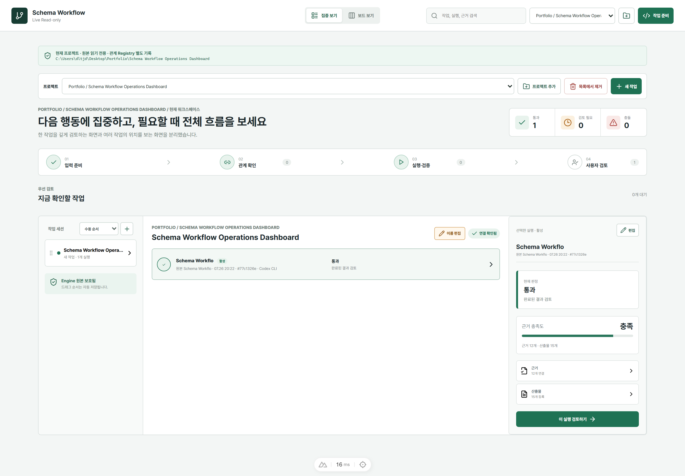
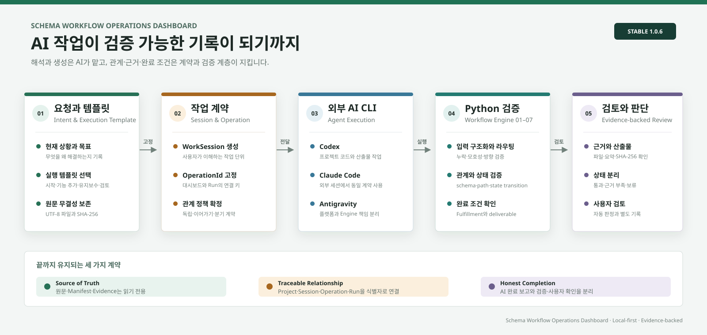
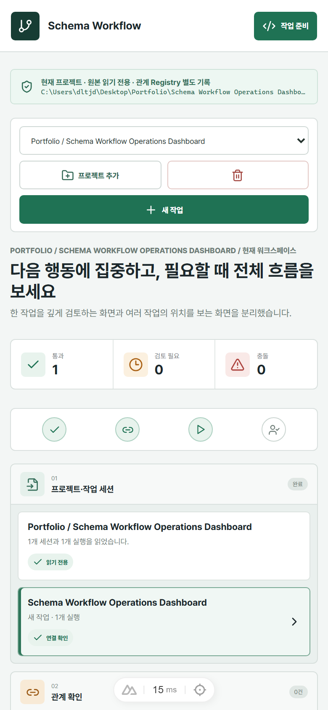
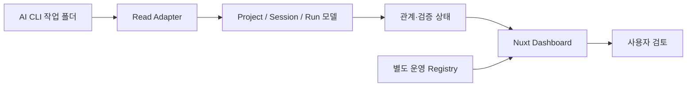

<div align="center">

# Schema Workflow Operations Dashboard

**여러 AI CLI의 작업 기록을 프로젝트, 작업 세션, 실행, 근거, 산출물 관계로 연결해 검토하는 로컬 운영 대시보드**


</div>

<p align="center">
  
</p>

## 프로젝트 소개

Codex, Claude Code, Antigravity 같은 AI CLI를 여러 프로젝트에서 사용하면 요청, 실행 기록, 근거와 산출물이 서로 다른 폴더에 흩어집니다. 완료됐다는 응답만으로는 어떤 요청에서 시작됐고 무엇을 근거로 통과했는지 다시 확인하기 어렵습니다.

Schema Workflow Operations Dashboard는 로컬 파일을 원본으로 유지하면서 다음 관계를 한 화면에서 읽고 검토합니다.

```text
Project -> Work Session -> Run -> Evidence / Artifact -> User Review
```

대시보드는 원본 실행 기록을 임의로 수정하지 않습니다. 사용자가 붙인 표시 이름, 검토 상태, 정렬 순서처럼 화면 운영에 필요한 정보는 별도 Registry에 기록합니다.

### 일반 결과 뷰어와 다른 점

이 프로젝트는 산출물 파일을 모아 보여주는 화면에 그치지 않습니다. 요청부터 결과까지 다음 질문에 답할 수 있도록 관계와 검증 상태를 함께 보존합니다.

- 이 작업은 어떤 프로젝트와 사용자 작업 세션에서 시작됐는가?
- 새 작업인가, 기존 Run의 이어가기 또는 분기인가?
- AI가 완료했다고 말한 것과 실제 검증 완료가 일치하는가?
- 결과를 뒷받침하는 근거와 최종 산출물이 실제 파일로 존재하는가?
- 통과한 Run을 사용자가 아직 검토하지 않았는가?

AI는 해석과 생성을 담당하고, 파일 경로·해시·관계·상태 전환·완료 조건은 Engine과 Gateway가 검증합니다. Dashboard는 이 결과를 변경하지 않고 운영자가 읽고 판단할 수 있는 형태로 투영합니다.

## 주요 기능

| 기능 | 설명 |
|---|---|
| 프로젝트 카탈로그 | 여러 ProjectRoot를 등록하고 작업 공간을 전환합니다. |
| 작업 세션 관리 | 새 작업, 이어가기, 분기를 구분하고 동일 Run의 관계를 추적합니다. |
| 실행 템플릿 | 프로젝트 시작, 기능 추가, 유지보수, 완료 검토용 실행 명세를 생성합니다. |
| 상태 검토 | 통과, 근거 부족, 보류와 사용자 미검토 상태를 구분합니다. |
| 파이프라인 상세 검토 | 실행 기준, Run, 근거, 산출물, 완료 검증을 한 흐름으로 대조합니다. |
| 근거·산출물 탐색 | 연결된 파일명과 요약을 확인하고 실제 산출물 경로를 추적합니다. |
| 표시 정보 편집 | 긴 Run ID 대신 사용자 제목과 메모를 사용하되 원본 식별자는 함께 보존합니다. |
| CLI 작업 준비 | 플랫폼별 실행 명령과 프로젝트 스킬 상태를 확인하고 VS Code 작업 공간을 준비합니다. |
| 반응형 화면 | 데스크톱 집중 화면, 전체 보드와 모바일 검토 화면을 제공합니다. |

## 실제 사용 흐름

| 단계 | 사용자가 하는 일 | 시스템이 남기는 것 |
|---|---|---|
| 1. 프로젝트 선택 | 기존 ProjectRoot를 선택하거나 새 프로젝트를 등록 | 프로젝트 계약과 식별자 |
| 2. 작업 정의 | 새 작업·기능 추가·유지보수·완료 검토 템플릿에 상황과 제약 입력 | 재사용 템플릿과 프로젝트 실행본 |
| 3. CLI 준비 | Codex, Claude Code, Antigravity 중 실행 환경 선택 | OperationId, 관계 계약, 원문 파일 |
| 4. Workflow 실행 | 외부 CLI가 Engine을 사용해 분석·생성·검증 | Run manifest, Evidence, Artifact |
| 5. 자동 연결 | OperationId와 관계 계약으로 Run을 작업 세션에 연결 | 독립·이어가기·분기 관계 |
| 6. 상세 검토 | 파이프라인 명세에서 요청, 기준, 근거, 산출물, 완료 검증 대조 | 검증 상태와 다음 행동 |
| 7. 사용자 확인 | 통과·근거 부족·보류를 확인하고 검토 완료 처리 | 원본과 분리된 사용자 검토 상태 |

### 상태를 읽는 기준

- **통과**: 현재 자동 검증 기준을 충족했습니다. 사용자 검토 완료와는 별개입니다.
- **근거 부족**: 결과가 있어도 출처, 필수 필드 또는 검증 근거가 충분하지 않습니다.
- **보류**: 사용자 결정, 외부 조건 또는 후속 작업이 필요합니다.
- **미검토**: 자동 검증을 통과했지만 사용자가 아직 결과를 확인하지 않았습니다.

## 기술 흐름

<p align="center">
  
</p>

이 흐름에서 Dashboard는 AI를 직접 실행하는 거대한 통합 도구가 아닙니다. 실행 전에는 원문과 관계 계약을 준비하고, 실행 후에는 Engine이 남긴 근거를 읽어 사용자가 현재 상태와 다음 행동을 판단할 수 있게 합니다.

## 화면

<table>
  <tr>
    <td width="32%" align="center">
      
    </td>
    <td width="68%">
      <strong>화면 크기가 달라도 같은 판단 흐름을 유지합니다.</strong>
      <br><br>
      프로젝트와 작업 세션을 선택한 뒤 Run 상태, 다음 행동, 근거와 산출물을 확인합니다. 모바일에서는 핵심 단계와 현재 선택 항목을 세로 흐름으로 제공합니다.
    </td>
  </tr>
</table>

## 구조



### 책임 경계

| 구성요소 | 책임 | 하지 않는 일 |
|---|---|---|
| AI CLI | 자연어 해석, 후보 생성, 산출물 작성 | 검증되지 않은 값을 자동 확정하지 않음 |
| Python Workflow Engine | 입력 구조화, 스키마·상태·완료 조건 검증 | 사용자 대신 최종 판단하지 않음 |
| Relationship Gateway | 작업 세션과 Run 관계의 생성·수정·충돌 방지 | Run manifest를 직접 수정하지 않음 |
| Nuxt Dashboard | 원본 상태 조회, 실행 준비, 상세 검토, 사용자 메타데이터 관리 | Engine 판정을 화면 편집으로 덮어쓰지 않음 |
| Release Manager | 설치본 무결성, 활성 버전, rollback 경계 관리 | 프로젝트 실행 데이터에 관여하지 않음 |

```text
Schema-Workflow-Operations-Dashboard/
├─ apps/dashboard-vnext/   Nuxt 대시보드와 테스트
├─ packaging/              Windows 번들 빌드·설치·실행 스크립트
├─ fixtures/               공개 가능한 익명 Mock 데이터
├─ deliverables/           설계, 검증, 포트폴리오 문서와 화면 이미지
├─ LICENSE
└─ THIRD_PARTY_NOTICES.md
```

## 빠른 화면 확인

Node.js 20 이상과 Corepack이 필요합니다.

```powershell
git clone https://github.com/LEESEOBAEK/Schema-Workflow-Operations-Dashboard.git
Set-Location '.\Schema-Workflow-Operations-Dashboard\apps\dashboard-vnext'
corepack pnpm install --frozen-lockfile
$env:NUXT_DASHBOARD_DATA_MODE = 'mock'
corepack pnpm dev --port 3215
```

브라우저에서 `http://localhost:3215/hybrid`를 엽니다. Mock 모드는 실제 사용자 경로나 운영 데이터 없이 화면과 공개 기능을 확인하기 위한 방식입니다.

## Windows 통합 번들

실제 로컬 운영은 GitHub Release에 첨부되는 `SchemaWorkflow-Windows-<version>.zip` 형식을 사용합니다. 압축 해제 후 승인 플래그와 함께 설치하고 실행합니다.

```powershell
powershell.exe -NoProfile -ExecutionPolicy Bypass -File `
  .\Install-SchemaWorkflowBundle.ps1 `
  -Channel stable `
  -Approved

powershell.exe -NoProfile -ExecutionPolicy Bypass -File `
  .\Start-SchemaWorkflowDashboard.ps1 `
  -Port 3215
```

통합 번들은 파일 무결성, 불변 엔진 릴리스, 활성 버전과 `doctor` 상태를 확인합니다. 프로젝트별 스킬 설치와 자동 실행 허용은 대시보드에서 별도 승인을 받아 처리합니다.

## 검증 상태

현재 공개 소스 기준 검증 결과입니다.

- Dashboard 테스트: `92/92` 통과
- TypeScript 및 Nuxt 타입 검사: 통과
- Nuxt 운영 빌드: 통과
- Windows 안정판 번들: `1.0.6`
- 공개 안전성: 실제 운영 Database, `.env`, `.data`, 실행 로그 제외

Dashboard `1.0.6` 동기화에서는 운영판 추적 파일 90개와 공개 저장소를 SHA-256으로 비교해 `90/90` 일치를 확인했습니다. 현재 README와 문서 인덱스의 내부 링크 29개도 모두 유효하며, 공개 범위에서 사용자 절대경로와 비밀값 신규 노출은 발견되지 않았습니다.

성능 수치는 PC 환경과 데이터 규모에 따라 달라집니다. 자세한 측정 조건은 [성능 기준 문서](deliverables/performance_baseline.md)를 참고하세요.

## 범위와 제한

### 현재 포함

- Windows 개인 로컬 운영
- Codex, Claude Code, Antigravity 작업 결과 읽기
- Project, Work Session, Run 관계와 근거 표시
- 실행 템플릿과 파이프라인 상세 검토
- 사용자 검토 및 표시 정보 관리
- 익명 Mock 모드와 Windows 통합 패키징

### 아직 보장하지 않음

- 다중 사용자 권한과 원격 협업
- Windows 이외 운영 환경
- 500개 이상 Run에 대한 대규모 성능
- 모든 AI CLI 버전에 대한 자동 호환
- AI의 숨은 추론 과정 수집

## 문서

| 문서 | 내용 |
|---|---|
| [1.0.6 동기화 보고서](deliverables/release_1.0.6_sync_report.md) | 현재 운영판과 공개 소스의 일치 범위와 검증 결과 |
| [포트폴리오 사례](deliverables/portfolio_case_study.md) | 문제 정의, 실제 결함, 개선 과정과 현재 결과 |
| [아키텍처](deliverables/architecture.md) | 구성요소, 실행 명세, 데이터 흐름과 책임 경계 |
| [기술 의사결정](deliverables/technical_decisions.md) | 선택한 구조, 이유와 감수한 트레이드오프 |
| [기능 상태표](deliverables/feature_status_matrix.md) | 1.0.6 기능별 완료, 제한, 다음 검증 범위 |
| [개발 기준선 검증 보고서](deliverables/validation_report.md) | 초기 후보판 당시 테스트와 운영 감사 기록 |
| [공개 패키지 검증](deliverables/public_package_validation.md) | 공개 안전성과 구성 확인 |

## 공개 원칙

이 저장소에는 익명 Mock 데이터만 포함합니다. 실제 운영 Database, 사용자 절대경로, `.env`, `.data`, 실행 로그와 설치된 엔진 릴리스는 Git에서 제외합니다. 소스 코드는 MIT License로 공개하며 포함된 글꼴은 각 배포 라이선스를 따릅니다.
