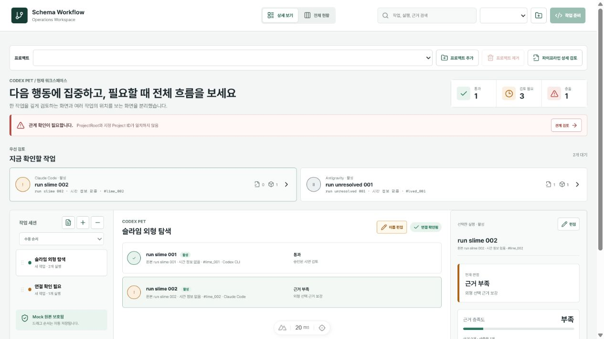

<div align="center">

# Schema Workflow Operations Dashboard

여러 AI CLI의 작업 관계와 결과를 근거 기반으로 검토하기 위해 제작한
Windows 로컬 운영 대시보드입니다.




</div>

## 1. 문제와 목표

Codex, Claude Code, Antigravity의 요청·실행·근거·산출물이 서로 다른 폴더에
흩어지면서 작업의 완료 여부와 연결 관계를 확인하기 어려웠습니다. 이를 해결하기
위해 채팅의 완료 문구가 아니라 아래 관계를 기준으로 작업 상태를 복원하고
검토하는 도구를 구현했습니다.

```text
Project → WorkSession → Operation → Run → Evidence / Artifact
```

## 2. 구현 결과

- Nuxt Dashboard와 Python Workflow Engine의 책임을 분리했습니다.
- 새 작업·이어가기·분기 관계와 중복 Run을 추적했습니다.
- 자동 검증, 근거 부족, 사용자 검토 상태를 서로 구분했습니다.
- 원본 실행 기록은 읽기 전용으로 유지하고 표시 이름과 메모는 별도로 관리했습니다.
- 익명 Mock 데이터와 Windows 배포 구성을 포함했습니다.

`Nuxt 4` · `TypeScript` · `Vitest` · `Python` · `JSON/JSONL` · `Windows`

## 3. 검증과 현재 상태

- Dashboard 테스트: **92/92 PASS**
- TypeScript typecheck 및 Nuxt production build: **PASS**
- 운영판·공개판 추적 파일 SHA-256 비교: **90/90 일치**
- 공개 안전성 검사: 사용자 경로·비밀값·실행 데이터 신규 노출 **0건**

이 저장소는 현재 운영에 사용하지 않으며, 문제 정의부터 구현·검증까지의 과정을
보존하는 **포트폴리오 아카이브**입니다. 자세한 내용은
[포트폴리오 사례](deliverables/portfolio_case_study.md),
[아키텍처](deliverables/architecture.md),
[검증 보고서](deliverables/validation_report.md)에서 확인할 수 있습니다.

MIT License
