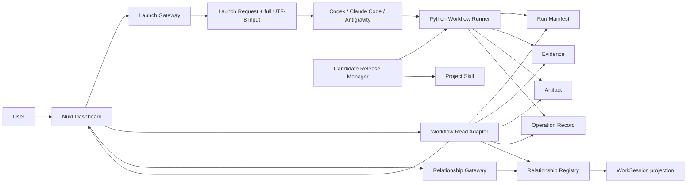
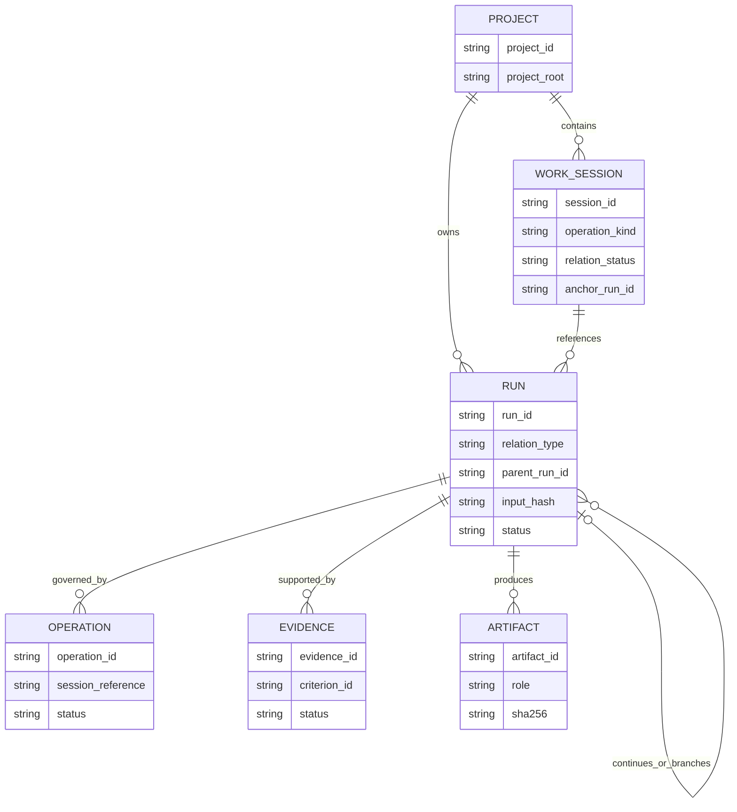
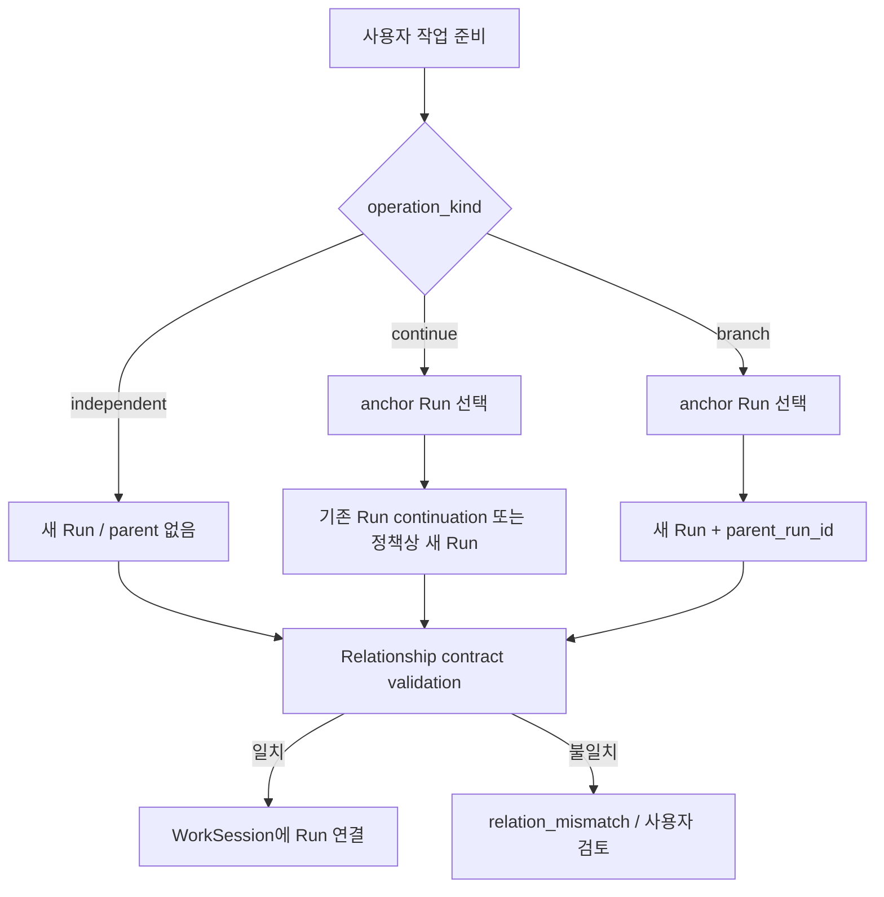
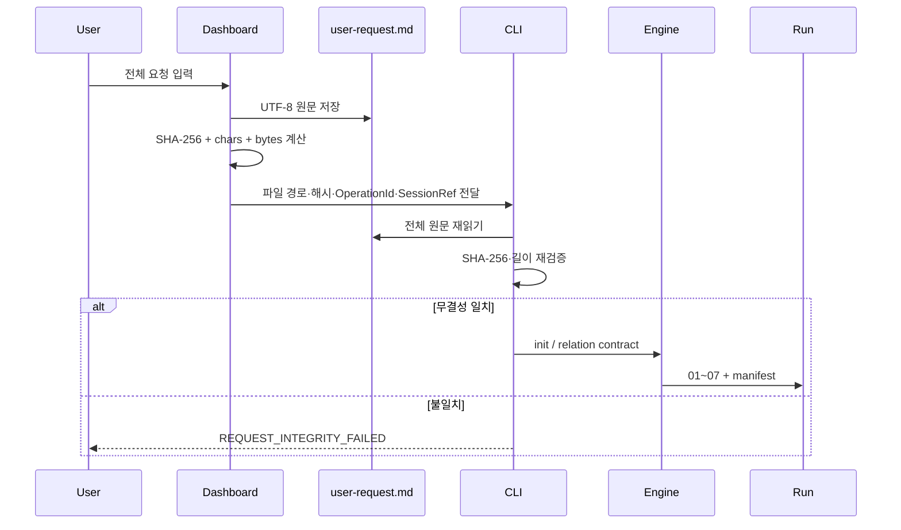

# Architecture

## 설계 목표

원본 Workflow 기록을 단일 진실 공급원으로 유지하면서, 여러 AI CLI가 만든 작업을 Project·WorkSession·Run 관계로 안전하게 연결하고 검증 가능한 운영 화면으로 투영한다.

## 시스템 구조

쓰기 권한은 경계별로 분리됩니다.

- Workflow Runner: `outputs/workflows`의 Run·Operation·Artifact 계약
- Relationship Gateway: ProjectRoot의 관계 Registry와 event log
- Dashboard Metadata Store: 표시명·메모·태그·정렬
- Read Adapter: 위 원본을 수정하지 않고 화면 모델로 변환

## 핵심 엔터티

WorkSession은 UI의 작업 단위이고 Run은 Engine의 실행 단위입니다. 동일하지 않기 때문에 `OperationId`와 관계 계약으로 연결합니다.

## 새 작업·이어가기·분기

| 작업 | 결과 정책 | 기대 관계 | parent |
|---|---|---|---|
| 새 작업 | create new | independent | 없음 |
| 이어가기 | continuation 정책 | continuation | anchor 또는 target 계약 |
| 분기 | create new | branch | anchor Run |

`Run 연결 완료`는 관계 등록의 완료일 뿐 사용자 원문의 최종 목표 완료가 아닙니다.

## 원문 보존과 처리 흐름

Context Capsule의 summary는 탐색용이고, 완료 계약은 항상 전체 원문 파일과 SHA-256입니다.

## 01~07 Workflow

```mermaid
flowchart LR
    S[Source input] --> L1[01 Input Structuring]
    L1 --> L2[02 Facet Router]
    L2 --> L3[03 Route Validation]
    L3 --> L4[04 Direction Lens]
    L4 --> L5[05 Situation Context]
    L5 --> L6[06 Human Report]
    L6 --> L7[07 Fulfillment]
    L7 --> A[Artifact registration]
    A --> D[DeliverablePath + SHA-256]
```

01~06은 분석의 완성도를 검증하고, 07은 실제 요청 결과의 존재·기준 통과·산출물 등록을 검증합니다. `artifact_ready`는 반복 산출물 준비 상태이며 최종 완료의 충분조건이 아닙니다.

## 외부 AI CLI

Dashboard는 AI 모델을 내장하지 않습니다. 플랫폼별 Skill을 점검하고, 전체 원문과 관계 계약을 보존한 launch request를 준비한 뒤 외부 CLI가 선택된 ProjectRoot에서 실행됩니다.

장점:

- 플랫폼 교체와 Engine 계약 분리
- 대시보드가 추론 비밀이나 인증 정보를 소유하지 않음
- Run 생성 실패와 UI 상태를 별도로 진단

트레이드오프:

- 프로세스 종료와 실제 작업 완료를 혼동하면 안 됨
- 플랫폼별 실행 텔레메트리 차이가 존재
- 자동 실행은 격리·승인된 ProjectRoot에만 허용해야 함

## Candidate Release

Candidate 채널은 사용자 단위 설치본, 활성 release pointer, release manifest hash로 운영합니다. Dashboard는 프로젝트 스킬의 버전·채널·관리 파일 변경을 검사하고, Engine은 `tool_root`와 Python fingerprint를 Run manifest에 남깁니다.

Stable 승격 전 필요한 항목:

1. Candidate 무결성 검사
2. 전체 회귀
3. 실제 작업 검증
4. 원본 fingerprint 비교
5. 알려진 제한과 rollback 조건 기록

## 데이터 경계

| 저장소 | 소유자 | Dashboard 권한 |
|---|---|---|
| Run manifest / Evidence / Artifact | Workflow Engine | 읽기 |
| Relationship Registry / events | Relationship Gateway | Gateway 경유 쓰기 |
| Dashboard `.data` | Metadata Store | 표시 정보만 쓰기 |
| Candidate install | Release Manager | 상태·무결성 조회 |
| 운영 Database | 각 ProjectRoot | 익명 집계만 읽기 |
